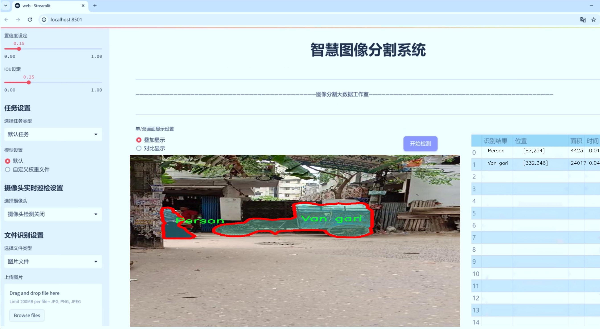
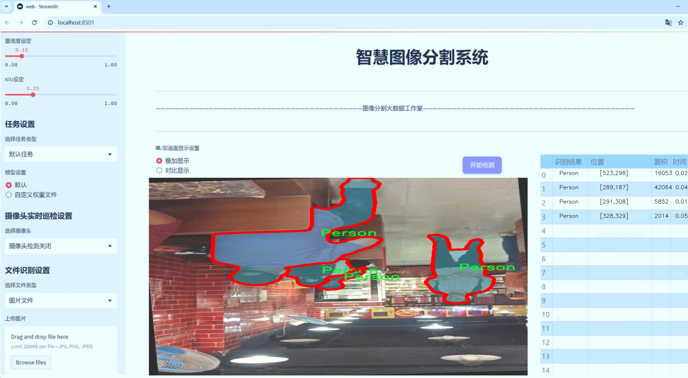
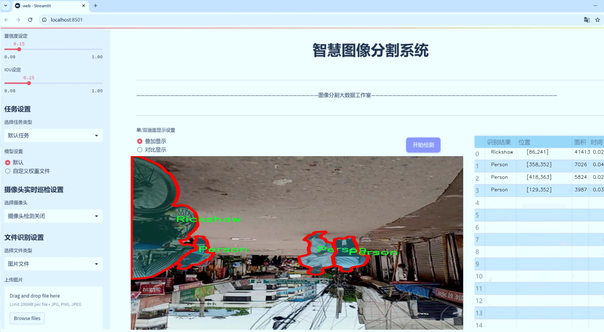
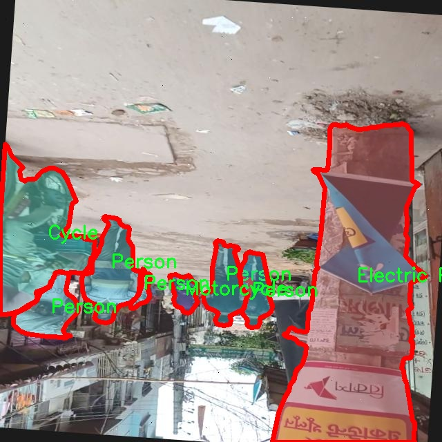
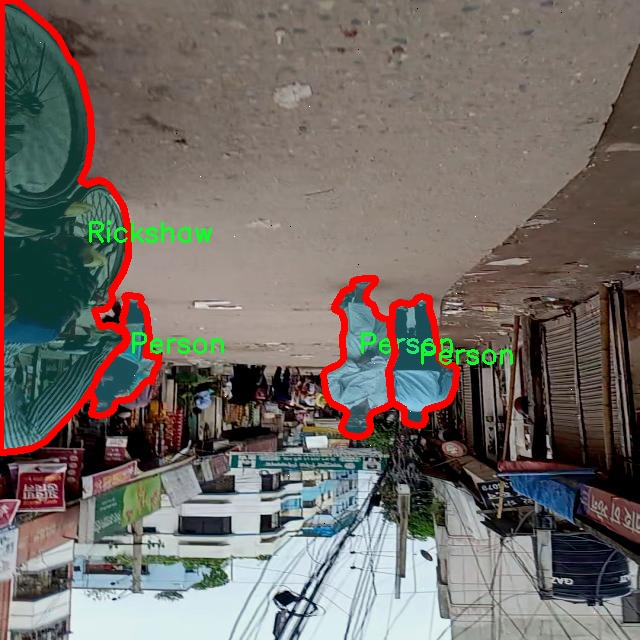
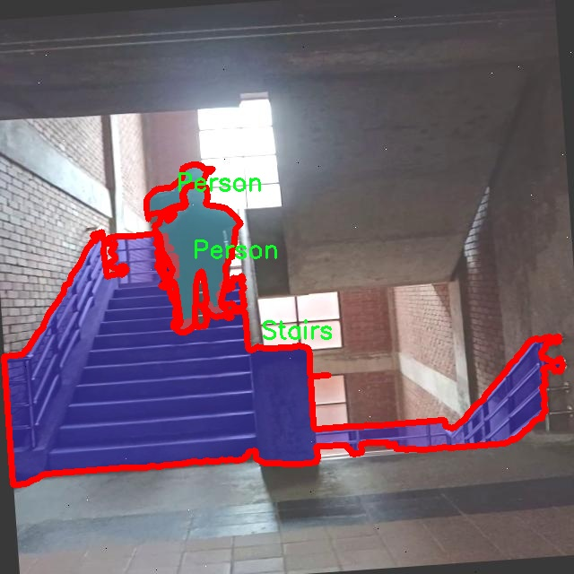
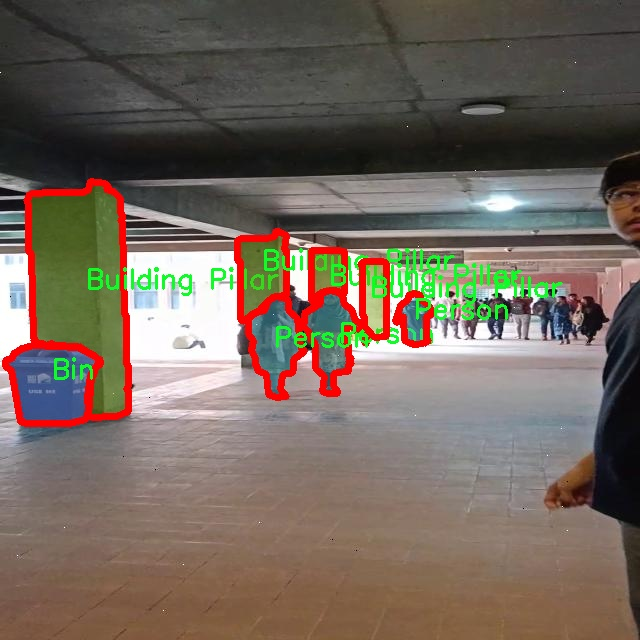
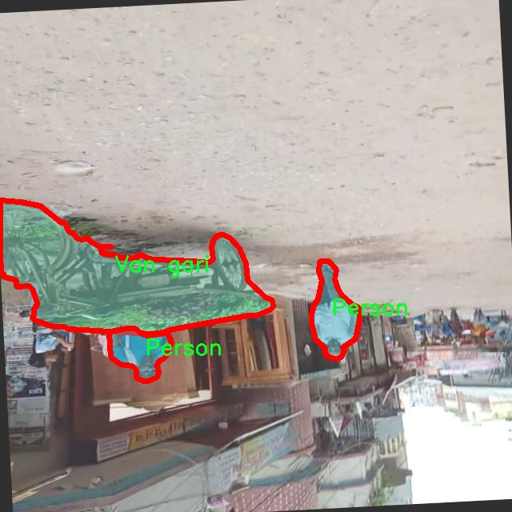
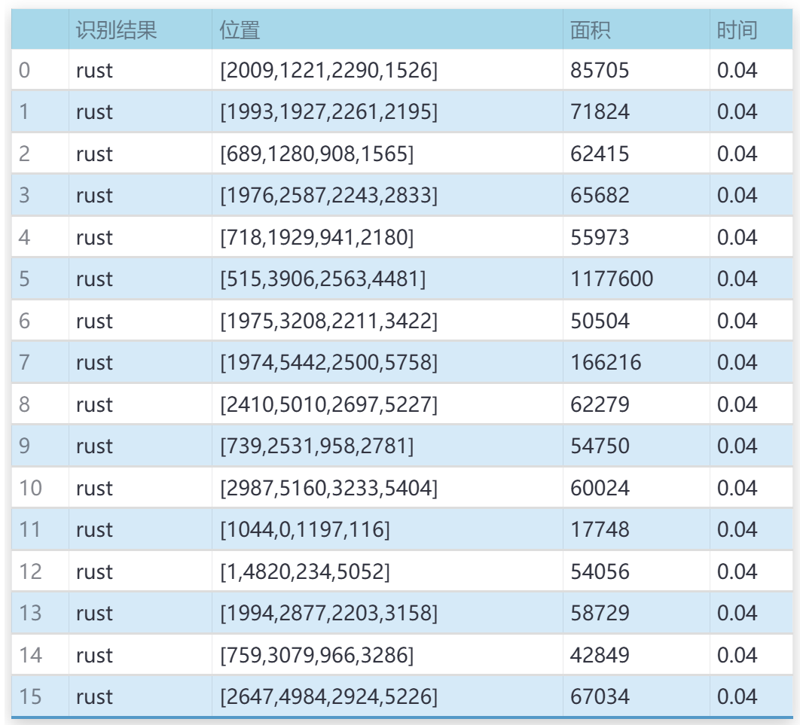

# 城市交通场景分割系统源码＆数据集分享
 [yolov8-seg-p6＆yolov8-seg-aux等50+全套改进创新点发刊_一键训练教程_Web前端展示]

### 1.研究背景与意义

项目参考[ILSVRC ImageNet Large Scale Visual Recognition Challenge](https://gitee.com/YOLOv8_YOLOv11_Segmentation_Studio/projects)

项目来源[AAAI Global Al lnnovation Contest](https://kdocs.cn/l/cszuIiCKVNis)

研究背景与意义

随着城市化进程的加快，城市交通问题日益突出，交通拥堵、事故频发以及环境污染等问题严重影响了城市的可持续发展。为了有效管理和改善城市交通状况，交通场景的实时监测与分析显得尤为重要。近年来，计算机视觉技术的迅猛发展为交通场景的自动化监测提供了新的解决方案。其中，基于深度学习的目标检测与分割技术，尤其是YOLO（You Only Look Once）系列模型，因其高效性和准确性而备受关注。YOLOv8作为该系列的最新版本，具备更强的特征提取能力和实时处理能力，为城市交通场景的智能分析提供了有力的技术支持。

本研究旨在基于改进的YOLOv8模型，构建一个高效的城市交通场景分割系统。该系统将利用一个包含1600张图像和19个类别的定制数据集，涵盖了城市交通中常见的物体，如汽车、行人、交通标志等。这些类别的细致划分，不仅有助于提高模型的识别精度，还能为后续的交通流量分析、行为预测等提供丰富的数据基础。通过对不同类别物体的精准分割与识别，系统能够实时获取交通场景的动态信息，为交通管理部门提供科学决策依据。

在现有的交通监测系统中，传统的图像处理方法往往无法满足复杂城市环境下的实时性和准确性要求。而基于YOLOv8的改进模型，结合实例分割技术，能够在保证高帧率的同时，提供更为细致的物体边界信息。这种高效的分割能力，使得系统不仅能够识别交通参与者的种类，还能准确定位其在场景中的位置，从而为交通流量分析、事故预警等应用提供重要支持。

此外，研究的意义还体现在推动智能交通系统的发展。随着物联网和大数据技术的不断进步，城市交通管理亟需向智能化、自动化转型。基于改进YOLOv8的城市交通场景分割系统，能够为智能交通系统的构建提供重要的技术支撑，促进交通数据的实时采集与分析，提升城市交通管理的智能化水平。同时，该系统的应用也将为交通安全、环境保护等方面提供有力的保障，助力实现城市的可持续发展目标。

综上所述，基于改进YOLOv8的城市交通场景分割系统的研究，不仅具有重要的理论价值，还具有广泛的应用前景。通过对城市交通场景的深入分析与研究，将为未来的智能交通管理提供新的思路与方法，推动城市交通系统的优化与升级。

### 2.图片演示







##### 注意：由于此博客编辑较早，上面“2.图片演示”和“3.视频演示”展示的系统图片或者视频可能为老版本，新版本在老版本的基础上升级如下：（实际效果以升级的新版本为准）

  （1）适配了YOLOV8的“目标检测”模型和“实例分割”模型，通过加载相应的权重（.pt）文件即可自适应加载模型。

  （2）支持“图片识别”、“视频识别”、“摄像头实时识别”三种识别模式。

  （3）支持“图片识别”、“视频识别”、“摄像头实时识别”三种识别结果保存导出，解决手动导出（容易卡顿出现爆内存）存在的问题，识别完自动保存结果并导出到tempDir中。

  （4）支持Web前端系统中的标题、背景图等自定义修改，后面提供修改教程。

  另外本项目提供训练的数据集和训练教程,暂不提供权重文件（best.pt）,需要您按照教程进行训练后实现图片演示和Web前端界面演示的效果。

### 3.视频演示

[3.1 视频演示](https://www.bilibili.com/video/BV1QoynYbE5o/)

### 4.数据集信息展示

##### 4.1 本项目数据集详细数据（类别数＆类别名）

nc: 19
names: ['Bin', 'Building Pillar', 'Bus', 'CNG', 'Car', 'Cycle', 'Electric Pole', 'Food Van', 'Food cart', 'Footpath', 'Motorcycle', 'Obstacle', 'Parking Cone', 'Person', 'Pickup', 'Rickshaw', 'Stairs', 'Van', 'Van gari']


##### 4.2 本项目数据集信息介绍

数据集信息展示

在本研究中，我们使用了名为“Custom Object Detect 1”的数据集，以支持对城市交通场景的分割系统进行训练，旨在改进YOLOv8-seg模型的性能。该数据集专门设计用于捕捉城市环境中的多种物体，涵盖了19个不同的类别，反映了城市交通的复杂性和多样性。这些类别包括：垃圾桶（Bin）、建筑柱（Building Pillar）、公交车（Bus）、压缩天然气车辆（CNG）、小汽车（Car）、自行车（Cycle）、电线杆（Electric Pole）、食品车（Food Van）、食品摊（Food cart）、人行道（Footpath）、摩托车（Motorcycle）、障碍物（Obstacle）、停车锥（Parking Cone）、行人（Person）、皮卡车（Pickup）、人力车（Rickshaw）、楼梯（Stairs）、厢式货车（Van）以及小型货车（Van gari）。这些类别的选择旨在全面覆盖城市交通场景中常见的物体，为模型提供丰富的训练数据。

“Custom Object Detect 1”数据集的构建过程经过精心设计，确保了数据的多样性和代表性。数据集中的图像来自不同的城市环境，涵盖了白天和夜晚、晴天和雨天等多种天气条件。这种多样性不仅提高了模型的鲁棒性，还使其能够在不同的实际应用场景中表现出色。每个类别的样本数量经过合理分配，以确保模型在训练过程中能够学习到每种物体的特征，避免因类别不平衡而导致的性能下降。

在数据标注方面，数据集采用了高精度的标注技术，确保每个物体的边界框和分割掩码都准确无误。这对于训练分割模型至关重要，因为模型需要精确地识别和分割出每个物体的轮廓。数据集中的标注不仅包括物体的类别信息，还包含了物体在图像中的位置和形状信息，这为后续的模型训练提供了坚实的基础。

为了进一步提升模型的训练效果，我们在数据预处理阶段对图像进行了多种增强操作，包括随机裁剪、旋转、缩放和颜色调整等。这些操作旨在增加数据集的多样性，帮助模型更好地适应不同的输入条件，从而提高其在实际应用中的泛化能力。

在训练过程中，我们将“Custom Object Detect 1”数据集与YOLOv8-seg模型相结合，利用其强大的特征提取能力和高效的分割算法，旨在实现对城市交通场景的精准分割。通过对数据集的深入分析和模型的反复调优，我们期望能够显著提升模型在复杂城市环境中的表现，使其在智能交通系统、自动驾驶和城市规划等领域具有广泛的应用潜力。

综上所述，“Custom Object Detect 1”数据集为本研究提供了丰富而多样的训练素材，支持我们在城市交通场景分割任务中的探索与创新。通过对该数据集的有效利用，我们希望能够推动YOLOv8-seg模型的进一步发展，为未来的智能交通解决方案奠定坚实的基础。











### 5.全套项目环境部署视频教程（零基础手把手教学）

[5.1 环境部署教程链接（零基础手把手教学）](https://www.bilibili.com/video/BV1jG4Ve4E9t/?vd_source=bc9aec86d164b67a7004b996143742dc)


[5.2 安装Python虚拟环境创建和依赖库安装视频教程链接（零基础手把手教学）](https://www.bilibili.com/video/BV1nA4VeYEze/?vd_source=bc9aec86d164b67a7004b996143742dc)

### 6.手把手YOLOV8-seg训练视频教程（零基础小白有手就能学会）

[6.1 手把手YOLOV8-seg训练视频教程（零基础小白有手就能学会）](https://www.bilibili.com/video/BV1cA4VeYETe/?vd_source=bc9aec86d164b67a7004b996143742dc)


按照上面的训练视频教程链接加载项目提供的数据集，运行train.py即可开始训练



     Epoch   gpu_mem       box       obj       cls    labels  img_size
     1/200     0G   0.01576   0.01955  0.007536        22      1280: 100%|██████████| 849/849 [14:42<00:00,  1.04s/it]
               Class     Images     Labels          P          R     mAP@.5 mAP@.5:.95: 100%|██████████| 213/213 [01:14<00:00,  2.87it/s]
                 all       3395      17314      0.994      0.957      0.0957      0.0843

     Epoch   gpu_mem       box       obj       cls    labels  img_size
     2/200     0G   0.01578   0.01923  0.007006        22      1280: 100%|██████████| 849/849 [14:44<00:00,  1.04s/it]
               Class     Images     Labels          P          R     mAP@.5 mAP@.5:.95: 100%|██████████| 213/213 [01:12<00:00,  2.95it/s]
                 all       3395      17314      0.996      0.956      0.0957      0.0845

     Epoch   gpu_mem       box       obj       cls    labels  img_size
     3/200     0G   0.01561    0.0191  0.006895        27      1280: 100%|██████████| 849/849 [10:56<00:00,  1.29it/s]
               Class     Images     Labels          P          R     mAP@.5 mAP@.5:.95: 100%|███████   | 187/213 [00:52<00:00,  4.04it/s]
                 all       3395      17314      0.996      0.957      0.0957      0.0845


### 7.50+种全套YOLOV8-seg创新点代码加载调参视频教程（一键加载写好的改进模型的配置文件）

[7.1 50+种全套YOLOV8-seg创新点代码加载调参视频教程（一键加载写好的改进模型的配置文件）](https://www.bilibili.com/video/BV1Hw4VePEXv/?vd_source=bc9aec86d164b67a7004b996143742dc)

### 8.YOLOV8-seg图像分割算法原理

原始YOLOv8-seg算法原理

YOLOv8-seg算法是YOLO系列的最新进展，旨在将目标检测与图像分割相结合，提供更为全面的视觉理解能力。该算法的设计理念是通过高效的网络结构与创新的特征提取方法，实现对复杂场景中目标的精准识别与分割。YOLOv8-seg在YOLOv8的基础上，进一步优化了网络架构，增强了对细粒度特征的捕捉能力，特别是在处理小目标和复杂背景时，展现出显著的优势。

YOLOv8-seg的核心结构由四个主要部分组成：输入端、骨干网络、颈部网络和头部网络。输入端通过多种数据增强技术，如马赛克增强、自适应锚框计算和灰度填充，确保模型能够处理多样化的输入数据。这些技术不仅提高了模型的鲁棒性，还增强了其对不同场景的适应能力。

在骨干网络部分，YOLOv8-seg采用了轻量化的C2F模块替代了传统的C3模块。C2F模块通过引入更多的分支连接，增强了梯度流动，使得特征提取过程更加高效。这种结构的设计灵感来源于YOLOv7的ELAN结构，能够更好地捕捉图像中的细节特征，尤其是在复杂的环境中。与此同时，骨干网络中的卷积操作被优化为3×3的形式，深度设置为3、6、6、3，进一步提升了模型的计算效率。

颈部网络则是YOLOv8-seg的重要组成部分，它结合了特征金字塔网络（FPN）和路径聚合网络（PAN），实现了对不同尺度特征的有效融合。特征金字塔网络通过构建多层次的特征图，确保模型能够同时关注到大目标和小目标的特征。而路径聚合网络则通过上下采样和特征拼接的方式，增强了对不同尺度对象的特征融合能力。为了进一步提升模型的性能，YOLOv8-seg在颈部网络中引入了BiFPN结构，采用高效的双向跨尺度连接与加权特征融合策略，显著提高了特征提取的速度和准确性。

在头部网络方面，YOLOv8-seg采用了解耦头结构，将分类和回归过程分开处理。这一设计使得模型在进行目标检测时，能够更加专注于每个任务的细节，减少了任务间的干扰。头部网络中，正负样本的匹配策略采用了Task-Aligned Assigner方法，通过对分类与回归分数的加权，确保正样本的选择更加精准。此外，损失计算部分结合了二元交叉熵损失（BCELoss）和分布焦点损失（DFLoss），以提升模型对边界框预测的准确性。对于分割任务，YOLOv8-seg还引入了特定的损失函数，以确保分割结果的精细度和一致性。

YOLOv8-seg的优势不仅体现在其高效的结构设计上，还在于其对复杂场景的适应能力。通过对小目标的增强感知和对背景复杂性的有效处理，YOLOv8-seg能够在水面等复杂环境中实现更高的检测精度。这一切都得益于其在特征提取和融合过程中的创新设计，使得模型能够捕捉到更多的上下文信息，从而提高了对目标的感知能力。

然而，尽管YOLOv8-seg在多个方面取得了显著的进展，但在实际应用中仍然面临一些挑战。例如，在极端复杂的背景下，模型可能会出现定位误差，导致目标检测的准确性下降。为了解决这些问题，研究者们不断探索改进的方法，例如引入新的特征提取模块和优化损失函数，以提升模型的泛化能力和精准度。

总的来说，YOLOv8-seg算法通过一系列创新的设计和优化，成功地将目标检测与图像分割结合在一起，展现出强大的性能和广泛的应用潜力。随着研究的深入，YOLOv8-seg有望在更多实际场景中发挥重要作用，为计算机视觉领域的发展贡献新的力量。


### 9.系统功能展示（检测对象为举例，实际内容以本项目数据集为准）

图9.1.系统支持检测结果表格显示

  图9.2.系统支持置信度和IOU阈值手动调节

  图9.3.系统支持自定义加载权重文件best.pt(需要你通过步骤5中训练获得)

  图9.4.系统支持摄像头实时识别

  图9.5.系统支持图片识别

  图9.6.系统支持视频识别

  图9.7.系统支持识别结果文件自动保存

  图9.8.系统支持Excel导出检测结果数据




### 10.50+种全套YOLOV8-seg创新点原理讲解（非科班也可以轻松写刊发刊，V11版本正在科研待更新）

#### 10.1 由于篇幅限制，每个创新点的具体原理讲解就不一一展开，具体见下列网址中的创新点对应子项目的技术原理博客网址【Blog】：


[10.1 50+种全套YOLOV8-seg创新点原理讲解链接](https://gitee.com/qunmasj/good)

#### 10.2 部分改进模块原理讲解(完整的改进原理见上图和技术博客链接)【如果此小节的图加载失败可以通过CSDN或者Github搜索该博客的标题访问原始博客，原始博客图片显示正常】
### YOLOv8模型原理

YOLOv8是YOLO系列最新的模型,具有非常优秀的检测精度和速度。根据网络的深度与特征图的宽度大小, YOLOv8算法分为:YOLOv8-n、YOLOv8一s 、YOLOv8-m 、 YOLOv8-l、和 YOLOv8-x 5个版本。按照网络结构图,YOLOv8可分为: Inpul 、 Backbone , Neck和Head 4部分。


Backbone采用了CSPDarknet 架构，由CBS (标准卷积层)、C2f模块和 SPPF(金字塔池化）组成。通过5次标准卷积层和C2f模块逐步提取图像特征，并在网络末尾添加SPPF模块，将任意大小的输入图像转换成固定大小的特征向量。分别取P3、P4、P5层的特征提取结果，向Head输出80×80、40 × 40、20×20三个尺度的特征层。
C2f模块借鉴了残差网络(ResNet)以及ELAN的思想，其结构分为两个分支，主干部分利用Bottleneckm2%模块逐步加深网络，分支部分保留输入层通道并与主干部分特征进行融合，如图所示。通过标准卷积层提取新的特征层，相比于YOLOv5使用的C3模块，C2f模块可以在卷积层和全连接层之间建立一个平滑的转换，从而实现了参数的共享，提高了模型的效率和泛化能力。
Head采用了PAN-FPN 结构,将 Backbone输入的3个特征层进行多尺度融合，进行自顶向下(FAN)和自底向上 (PAN)的特征传递，对金字塔进行增强，使不同尺寸的特征图都包含强目标语义信息和强目标特征信息，保证了对不同尺寸样本的准确预测。
Detect借鉴了Decoupled-Head 思想，用一个解耦检测头将输入的不同尺寸特征层分成2个分支进行检测。第1个分支在进行3次卷积后使进行回归任务，输出预测框。第2个分支在进行3次卷积后进行分类任务，输出类别的概率。采用Varifocal_Loss2”作为损失函数，其式为:


### Context_Grided_Network(CGNet)简介
参考该博客提出的一种轻量化语义分割模型Context Grided Network(CGNet)，以满足设备的运行需要。

CGNet主要由CG块构建而成，CG块可以学习局部特征和周围环境上下文的联合特征，最后通过引入全局上下文特征进一步改善联合特征的学习。


 
下图给出了在Cityscapes数据集上对现有的一些语义分割模型的测试效果，横轴表示参数量，纵轴表示准确率(mIoU)。可以看出，在参数量较少的情况下，CGNet可以达到一个比较好的准确率。虽与高精度模型相去甚远，但在一些对精度要求不高、对实时性要求比较苛刻的情况下，很有价值。


高精度模型，如DeepLab、DFN、DenseASPP等，动不动就是几十M的参数，很难应用在移动设备上。而上图中红色的模型，相对内存占用较小，但它们的分割精度却不是很高。作者认为主要原因是，这些小网络大多遵循着分类网络的设计思路，并没有考虑语义分割任务更深层次的特点。

空间依赖性和上下文信息对提高分割精度有很大的作用。作者从该角度出发，提出了CG block，并进一步搭建了轻量级语义分割网络CGNet。CG块具有以下特点： 

学习局部特征和上下文特征的联合特征；
通过全局上下文特征改进上述联合特征；
可以贯穿应用在整个网络中，从low level（空间级别）到high level（语义级别）。不像PSPNet、DFN、DenseASPP等，只在编码阶段以后捕捉上下文特征。；
只有3个下采样，相比一般5个下采样的网络，能够更好地保留边缘信息。
CGNet遵循“深而薄”的原则设计，整个网络又51层构成。其中，为了降低计算，大量使用了channel-wise conv.

小型语义分割模型：

需要平衡准确率和系统开销
进化路线：ENet -> ICNet -> ESPNet
这些模型基本都基于分类网络设计，在分割准确率上效果并不是很好
上下文信息模型：

大多数现有模型只考虑解码阶段的上下文信息并且没有利用周围的上下文信息
注意力机制：

CG block使用全局上下文信息计算权重向量，并使用其细化局部特征和周围上下文特征的联合特征

#### Context Guided Block
CG block由4部分组成：


此外，CG block还采用了残差学习。文中提出了局部残差学习（LRL）和全局残差学习（GRL）两种方式。 LRL添加了从输入到联合特征提取器的连接，GRL添加了从输入到全局特征提取器的连接。从直观上来说，GRL比LRL更能促进网络中的信息传递（更像ResNet~~），后面实验部分也进行了测试，的确GRL更能提升分割精度。


CGNet的通用网络结构如下图所示，分为3个stage，第一个stage使用3个卷积层抽取特征，第二和第三个stage堆叠一定数量的CG block，具体个数可以根据情况调整。最后，通过1x1 conv得到分割结果。


下图是用于Cityscapes数据集的CGNet网络细节说明：输入尺寸为3*680*680；stage1连续使用了3个Conv-BN-PReLU组合，首个组合使用了stride=2的卷积，所以得到了1/2分辨率的feature map；stage2和stage3分别使用了多个CG block，且其中使用了不同大小的膨胀卷积核，最终分别得到了1/4和1/8的feature map。

需注意：

stage2&3的输入特征分别由其上一个stage的首个和最后一个block组合给出（参考上图的绿色箭头）；

输入注入机制，图中未体现，实际使用中，作者还将输入图像下采样1/4或1/8，分别给到stage2和stage3的输入中 ，以进一步加强特征传递。

channel-wise conv。为了缩减参数数量，在局部特征提取器和周围上下文特征提取器中使用了channel-wise卷积，可以消除跨通道的计算成本，同时节省内存占用。但是，没有像MobileNet等模型一样，在depth-wise卷积后面接point-wise卷积（1*1 conv），作者解释是，因为CG block需要保持局部特征和周围上下文特征的独立性，而1*1 conv会破坏这种独立性，所以效果欠佳，实验部分也进行了验证。

个人感觉此处应该指的是depth-wise卷积？

官方Git中对该部分的实现如下：


### 11.项目核心源码讲解（再也不用担心看不懂代码逻辑）

#### 11.1 ultralytics\models\sam\modules\tiny_encoder.py

以下是对给定代码的核心部分进行分析和详细注释的结果。保留了主要的类和方法，删除了冗余的部分，以便于理解 TinyViT 模型的结构和功能。

```python
import torch
import torch.nn as nn
import torch.nn.functional as F

class Conv2d_BN(torch.nn.Sequential):
    """执行2D卷积操作并紧接着进行批量归一化的序列容器。"""

    def __init__(self, in_channels, out_channels, kernel_size=1, stride=1, padding=0):
        """初始化卷积层和批量归一化层。"""
        super().__init__()
        self.add_module('conv', nn.Conv2d(in_channels, out_channels, kernel_size, stride, padding, bias=False))
        self.add_module('bn', nn.BatchNorm2d(out_channels))


class PatchEmbed(nn.Module):
    """将图像嵌入为补丁并投影到指定的嵌入维度。"""

    def __init__(self, in_chans, embed_dim, resolution, activation):
        """初始化补丁嵌入层。"""
        super().__init__()
        img_size = (resolution, resolution)  # 假设输入为正方形图像
        self.patches_resolution = (img_size[0] // 4, img_size[1] // 4)  # 计算补丁的分辨率
        self.seq = nn.Sequential(
            Conv2d_BN(in_chans, embed_dim // 2, kernel_size=3, stride=2, padding=1),
            activation(),
            Conv2d_BN(embed_dim // 2, embed_dim, kernel_size=3, stride=2, padding=1),
        )

    def forward(self, x):
        """将输入张量通过补丁嵌入序列进行处理。"""
        return self.seq(x)


class MBConv(nn.Module):
    """移动反向瓶颈卷积（MBConv）层，EfficientNet架构的一部分。"""

    def __init__(self, in_chans, out_chans, expand_ratio, activation):
        """初始化MBConv层。"""
        super().__init__()
        self.in_chans = in_chans
        self.hidden_chans = int(in_chans * expand_ratio)

        self.conv1 = Conv2d_BN(in_chans, self.hidden_chans, kernel_size=1)
        self.act1 = activation()
        self.conv2 = Conv2d_BN(self.hidden_chans, self.hidden_chans, kernel_size=3, padding=1, groups=self.hidden_chans)
        self.act2 = activation()
        self.conv3 = Conv2d_BN(self.hidden_chans, out_chans, kernel_size=1, bn_weight_init=0.0)
        self.act3 = activation()

    def forward(self, x):
        """实现MBConv层的前向传播。"""
        shortcut = x  # 残差连接
        x = self.conv1(x)
        x = self.act1(x)
        x = self.conv2(x)
        x = self.act2(x)
        x = self.conv3(x)
        x += shortcut  # 残差连接
        return self.act3(x)


class Attention(nn.Module):
    """多头注意力模块，支持空间感知。"""

    def __init__(self, dim, key_dim, num_heads=8):
        """初始化注意力模块。"""
        super().__init__()
        self.num_heads = num_heads
        self.scale = key_dim ** -0.5  # 缩放因子
        self.qkv = nn.Linear(dim, dim * 3)  # 线性层用于生成Q、K、V
        self.proj = nn.Linear(dim, dim)  # 输出线性层

    def forward(self, x):
        """执行前向传播，计算注意力。"""
        B, N, _ = x.shape  # B: 批量大小, N: 序列长度
        qkv = self.qkv(x).view(B, N, 3, self.num_heads, -1).transpose(2, 3)  # 生成Q、K、V
        q, k, v = qkv.unbind(2)  # 分离Q、K、V
        attn = (q @ k.transpose(-2, -1)) * self.scale  # 计算注意力得分
        attn = attn.softmax(dim=-1)  # 应用softmax
        x = (attn @ v)  # 计算加权和
        return self.proj(x)  # 投影回原始维度


class TinyViTBlock(nn.Module):
    """TinyViT块，应用自注意力和局部卷积。"""

    def __init__(self, dim, num_heads, window_size=7, mlp_ratio=4.):
        """初始化TinyViT块。"""
        super().__init__()
        self.attn = Attention(dim, dim // num_heads, num_heads)  # 注意力层
        self.mlp = nn.Sequential(
            nn.Linear(dim, int(dim * mlp_ratio)),
            nn.GELU(),
            nn.Linear(int(dim * mlp_ratio), dim)
        )  # MLP层

    def forward(self, x):
        """执行前向传播。"""
        x = self.attn(x)  # 通过注意力层
        return self.mlp(x)  # 通过MLP层


class TinyViT(nn.Module):
    """TinyViT架构，用于视觉任务。"""

    def __init__(self, img_size=224, in_chans=3, num_classes=1000, embed_dims=[96, 192, 384, 768], depths=[2, 2, 6, 2], num_heads=[3, 6, 12, 24]):
        """初始化TinyViT模型。"""
        super().__init__()
        self.patch_embed = PatchEmbed(in_chans, embed_dims[0], img_size, nn.GELU)  # 补丁嵌入层
        self.layers = nn.ModuleList()  # 存储各层
        for i in range(len(depths)):
            layer = nn.ModuleList([TinyViTBlock(embed_dims[i], num_heads[i]) for _ in range(depths[i])])
            self.layers.append(layer)  # 添加层

        self.head = nn.Linear(embed_dims[-1], num_classes)  # 分类头

    def forward(self, x):
        """执行前向传播。"""
        x = self.patch_embed(x)  # 通过补丁嵌入
        for layer in self.layers:
            for block in layer:
                x = block(x)  # 通过每个TinyViT块
        return self.head(x)  # 分类输出
```

### 主要组件说明：
1. **Conv2d_BN**: 实现了卷积和批量归一化的组合。
2. **PatchEmbed**: 将输入图像划分为补丁并嵌入到高维空间。
3. **MBConv**: 实现了移动反向瓶颈卷积，具有残差连接。
4. **Attention**: 实现了多头注意力机制，计算输入特征的注意力权重。
5. **TinyViTBlock**: 结合了注意力机制和MLP的模块。
6. **TinyViT**: 整个模型的结构，包含多个TinyViT块和分类头。

以上代码保留了TinyViT模型的核心结构和功能，去除了不必要的细节，使其更易于理解。

这个文件实现了一个名为 TinyViT 的视觉模型架构，主要用于图像分类等视觉任务。TinyViT 是基于 Transformer 的架构，结合了卷积操作，旨在提高模型的效率和性能。文件中包含多个类，每个类实现了模型的不同部分。

首先，文件引入了一些必要的库，包括 PyTorch 和一些工具函数。接着定义了几个基础组件，例如 `Conv2d_BN` 类，它是一个顺序容器，执行二维卷积操作并随后进行批量归一化。这种结构在深度学习中非常常见，有助于提高模型的训练稳定性。

接下来是 `PatchEmbed` 类，它负责将输入图像分割成小块（patches），并将这些小块映射到指定的嵌入维度。这一过程对于 Transformer 模型至关重要，因为它们通常处理的是序列数据，而图像需要被转换为适合这种处理的格式。

`MBConv` 类实现了 Mobile Inverted Bottleneck 卷积层，这是 EfficientNet 架构中的一个重要组成部分。它通过扩展和压缩通道数来提高模型的表达能力，同时保持计算效率。这个类还包含激活函数和可选的 DropPath 机制，用于在训练期间引入随机性，帮助模型更好地泛化。

`PatchMerging` 类用于合并相邻的特征块，并将其投影到新的维度。这在模型的不同层之间进行下采样时非常有用。

`ConvLayer` 类是一个卷积层，包含多个 MBConv 层，并可选择性地对输出进行下采样。它还支持梯度检查点，以节省内存。

`Mlp` 类实现了多层感知机（MLP），通常用于 Transformer 中的前馈网络。它包括层归一化和两个全连接层。

`Attention` 类实现了多头自注意力机制，支持空间感知。它使用可训练的注意力偏置来增强模型对空间位置的敏感性。

`TinyViTBlock` 类结合了自注意力和局部卷积，形成了 TinyViT 的基本构建块。它在输入上应用注意力机制，然后通过局部卷积进行处理。

`BasicLayer` 类是 TinyViT 架构中的一个基本层，包含多个 TinyViTBlock。它可以选择性地在层的末尾进行下采样。

`LayerNorm2d` 类实现了二维层归一化，适用于卷积层的输出。

最后，`TinyViT` 类是整个模型的核心，负责构建和管理模型的各个层。它接受输入图像，经过多个处理层后，输出分类结果。该类还实现了权重初始化和学习率衰减的设置，以优化训练过程。

总的来说，这个文件实现了一个高效的视觉模型 TinyViT，结合了卷积和自注意力机制，旨在提高图像处理任务的性能。

#### 11.2 ui.py

以下是代码中最核心的部分，并附上详细的中文注释：

```python
import sys
import subprocess

def run_script(script_path):
    """
    使用当前 Python 环境运行指定的脚本。

    Args:
        script_path (str): 要运行的脚本路径

    Returns:
        None
    """
    # 获取当前 Python 解释器的路径
    python_path = sys.executable

    # 构建运行命令，使用 streamlit 运行指定的脚本
    command = f'"{python_path}" -m streamlit run "{script_path}"'

    # 执行命令
    result = subprocess.run(command, shell=True)
    # 检查命令执行的返回码，如果不为0则表示出错
    if result.returncode != 0:
        print("脚本运行出错。")

# 实例化并运行应用
if __name__ == "__main__":
    # 指定要运行的脚本路径
    script_path = "web.py"  # 这里可以替换为实际的脚本路径

    # 调用函数运行脚本
    run_script(script_path)
```

### 代码说明：
1. **导入模块**：
   - `sys`：用于访问与 Python 解释器相关的变量和函数。
   - `subprocess`：用于创建新进程、连接到它们的输入/输出/错误管道，并获得它们的返回码。

2. **`run_script` 函数**：
   - 接受一个参数 `script_path`，表示要运行的 Python 脚本的路径。
   - 使用 `sys.executable` 获取当前 Python 解释器的路径。
   - 构建一个命令字符串，用于通过 `streamlit` 运行指定的脚本。
   - 使用 `subprocess.run` 执行构建的命令，并检查返回码以确定脚本是否成功运行。

3. **主程序入口**：
   - 当脚本作为主程序运行时，指定要运行的脚本路径（这里是 `web.py`）。
   - 调用 `run_script` 函数执行指定的脚本。

这个程序文件名为 `ui.py`，其主要功能是通过当前的 Python 环境来运行一个指定的脚本。程序首先导入了必要的模块，包括 `sys`、`os` 和 `subprocess`，以及一个自定义的路径处理模块 `abs_path`。

在 `run_script` 函数中，程序接收一个参数 `script_path`，这个参数是要运行的脚本的路径。函数内部首先获取当前 Python 解释器的路径，这通过 `sys.executable` 实现。接着，程序构建了一个命令字符串，该命令用于调用 `streamlit` 来运行指定的脚本。命令的格式是 `"{python_path}" -m streamlit run "{script_path}"`，其中 `python_path` 是当前 Python 解释器的路径，`script_path` 是传入的脚本路径。

然后，程序使用 `subprocess.run` 方法来执行这个命令。`shell=True` 参数表示命令将在一个新的 shell 中执行。执行后，程序检查返回的结果，如果返回码不为 0，说明脚本运行出错，程序会打印出错误信息。

在文件的最后部分，程序通过 `if __name__ == "__main__":` 来判断是否是直接运行该脚本。如果是，它会指定要运行的脚本路径，这里是通过 `abs_path("web.py")` 来获取的，随后调用 `run_script` 函数来执行这个脚本。

总体来说，这个程序的目的是为了方便地在当前 Python 环境中运行一个名为 `web.py` 的脚本，并处理可能出现的错误。

#### 11.3 ultralytics\solutions\ai_gym.py

以下是经过简化和注释的核心代码部分：

```python
import cv2
from ultralytics.utils.plotting import Annotator

class AIGym:
    """用于管理基于姿势的实时视频流中的健身步骤的类。"""

    def __init__(self):
        """初始化AIGym，设置默认的视觉和图像参数。"""
        self.im0 = None  # 当前帧图像
        self.tf = None   # 线条厚度
        self.keypoints = None  # 姿势关键点
        self.poseup_angle = None  # 上升姿势角度
        self.posedown_angle = None  # 下降姿势角度
        self.threshold = 0.001  # 阈值
        self.angle = None  # 当前角度
        self.count = None  # 动作计数
        self.stage = None  # 当前阶段
        self.pose_type = 'pushup'  # 姿势类型
        self.kpts_to_check = None  # 需要检查的关键点
        self.view_img = False  # 是否显示图像
        self.annotator = None  # 注释器实例

    def set_args(self, kpts_to_check, line_thickness=2, view_img=False, pose_up_angle=145.0, pose_down_angle=90.0, pose_type='pullup'):
        """
        配置AIGym的参数
        Args:
            kpts_to_check (list): 用于计数的3个关键点
            line_thickness (int): 边界框的线条厚度
            view_img (bool): 是否显示图像
            pose_up_angle (float): 上升姿势的角度
            pose_down_angle (float): 下降姿势的角度
            pose_type: "pushup", "pullup" 或 "abworkout"
        """
        self.kpts_to_check = kpts_to_check
        self.tf = line_thickness
        self.view_img = view_img
        self.poseup_angle = pose_up_angle
        self.posedown_angle = pose_down_angle
        self.pose_type = pose_type

    def start_counting(self, im0, results, frame_count):
        """
        计数健身步骤的函数
        Args:
            im0 (ndarray): 当前视频流帧
            results: 姿势估计数据
            frame_count: 当前帧计数
        """
        self.im0 = im0  # 保存当前帧
        if frame_count == 1:
            # 初始化计数和角度
            self.count = [0] * len(results[0])
            self.angle = [0] * len(results[0])
            self.stage = ['-' for _ in results[0]]
        
        self.keypoints = results[0].keypoints.data  # 获取关键点数据
        self.annotator = Annotator(im0, line_width=2)  # 创建注释器实例

        # 遍历每个关键点
        for ind, k in enumerate(reversed(self.keypoints)):
            # 计算姿势角度
            self.angle[ind] = self.annotator.estimate_pose_angle(
                k[int(self.kpts_to_check[0])].cpu(),
                k[int(self.kpts_to_check[1])].cpu(),
                k[int(self.kpts_to_check[2])].cpu()
            )
            self.im0 = self.annotator.draw_specific_points(k, self.kpts_to_check, shape=(640, 640), radius=10)

            # 根据姿势类型更新计数和阶段
            if self.pose_type in ['pushup', 'pullup']:
                if self.angle[ind] > self.poseup_angle:
                    self.stage[ind] = 'up' if self.pose_type == 'pushup' else 'down'
                if self.angle[ind] < self.posedown_angle and self.stage[ind] == ('up' if self.pose_type == 'pushup' else 'down'):
                    self.stage[ind] = 'down' if self.pose_type == 'pushup' else 'up'
                    self.count[ind] += 1
            
            # 绘制角度、计数和阶段信息
            self.annotator.plot_angle_and_count_and_stage(
                angle_text=self.angle[ind],
                count_text=self.count[ind],
                stage_text=self.stage[ind],
                center_kpt=k[int(self.kpts_to_check[1])],
                line_thickness=self.tf
            )

            # 绘制关键点
            self.annotator.kpts(k, shape=(640, 640), radius=1, kpt_line=True)

        # 显示图像
        if self.view_img:
            cv2.imshow('Ultralytics YOLOv8 AI GYM', self.im0)
            if cv2.waitKey(1) & 0xFF == ord('q'):
                return

if __name__ == '__main__':
    AIGym()  # 实例化AIGym类
```

### 代码说明：
1. **类的定义**：`AIGym`类用于管理健身动作的计数和状态更新。
2. **初始化方法**：设置类的基本属性，包括图像、关键点、角度、计数等。
3. **设置参数方法**：允许用户配置关键点、线条厚度、是否显示图像及姿势类型等参数。
4. **计数方法**：处理每一帧图像，计算关键点的角度，更新动作计数和阶段，并绘制相关信息。
5. **显示图像**：如果设置为显示图像，则在窗口中展示当前帧，并允许用户通过按'q'键退出。

这个程序文件定义了一个名为 `AIGym` 的类，旨在通过实时视频流监测和计数人们的健身动作，主要是针对特定的姿势（如俯卧撑、引体向上和腹部锻炼）进行分析。以下是对代码的详细说明。

在类的初始化方法 `__init__` 中，定义了一些属性，包括图像、关键点、角度、计数和阶段等信息。这些属性用于存储当前帧的图像数据、姿势的关键点数据、计算出的角度、完成的动作计数以及当前的动作阶段（如“上”或“下”）。此外，还定义了一个 `pose_type` 属性，用于指定当前检测的姿势类型，默认为“俯卧撑”。

`set_args` 方法用于配置 `AIGym` 的参数，包括需要检查的关键点、线条厚度、是否显示图像、上举和下放的角度阈值以及姿势类型。该方法接受多个参数，允许用户根据需要自定义设置。

`start_counting` 方法是核心功能，用于处理每一帧图像，计算健身动作的数量。它接收当前帧图像、姿势估计结果和帧计数作为输入。在方法内部，首先将当前帧图像赋值给 `im0`，并在第一帧时初始化计数、角度和阶段的列表。接着，提取关键点数据并创建一个 `Annotator` 对象，用于在图像上绘制和标注。

随后，程序遍历每个关键点，根据当前的姿势类型（俯卧撑、引体向上或腹部锻炼）计算姿势角度，并根据角度的变化更新动作的阶段和计数。例如，对于俯卧撑，如果角度大于上举角度则标记为“上”，如果小于下放角度且当前阶段为“上”则标记为“下”，并增加计数。对于腹部锻炼，类似的逻辑也被应用。

每次计算后，程序会在图像上绘制当前的角度、计数和阶段信息，并标注关键点。最后，如果设置了 `view_img` 为 `True`，则会使用 OpenCV 显示当前帧图像，并允许用户通过按下 'q' 键退出显示。

在文件的最后，包含了一个主程序部分，创建了 `AIGym` 类的实例，但没有进一步的执行逻辑，这意味着该类的实例化可能是为了后续的扩展或集成到其他程序中。整体来看，这个程序为实时健身动作监测提供了一个基础框架，结合了计算机视觉和姿势估计技术。

#### 11.4 ultralytics\models\yolo\__init__.py

以下是代码中最核心的部分，并附上详细的中文注释：

```python
# 导入Ultralytics YOLO库中的分类、检测、姿态估计和分割功能
from ultralytics.models.yolo import classify, detect, pose, segment

# 从当前模块导入YOLO模型
from .model import YOLO

# 定义模块的公开接口，指定可以被外部访问的功能
__all__ = 'classify', 'segment', 'detect', 'pose', 'YOLO'
```

### 注释说明：
1. **导入功能**：
   - `from ultralytics.models.yolo import classify, detect, pose, segment`：这行代码从Ultralytics YOLO库中导入了四个主要功能模块，分别用于图像分类、目标检测、姿态估计和图像分割。这些功能是YOLO模型的核心应用。

2. **导入YOLO模型**：
   - `from .model import YOLO`：这行代码从当前目录下的`model`模块中导入了YOLO模型类，允许在当前模块中使用YOLO模型进行各种任务。

3. **定义公开接口**：
   - `__all__ = 'classify', 'segment', 'detect', 'pose', 'YOLO'`：这行代码定义了模块的公开接口，指定了哪些名称可以被外部导入。这是Python模块中常用的做法，帮助用户了解模块的主要功能。

这个程序文件是Ultralytics YOLO模型的初始化文件，文件名为`__init__.py`，它的主要作用是定义该模块的公共接口。

首先，文件开头的注释部分表明这是Ultralytics YOLO项目的一部分，并且该项目遵循AGPL-3.0许可证。这种许可证通常用于开源软件，允许用户自由使用、修改和分发软件，但要求在分发时也必须遵循相同的许可证条款。

接下来，文件通过`from`语句导入了四个功能模块：`classify`、`detect`、`pose`和`segment`，这些模块分别用于不同的任务。具体来说，`classify`用于图像分类，`detect`用于目标检测，`pose`用于姿态估计，而`segment`则用于图像分割。这些功能模块的导入使得用户可以方便地使用这些功能，而无需单独导入每个模块。

最后，`__all__`变量被定义为一个元组，包含了`classify`、`segment`、`detect`、`pose`和`YOLO`。这个变量的作用是指明当使用`from ultralytics.models.yolo import *`语句时，哪些名称会被导入。通过定义`__all__`，可以控制模块的公共接口，避免不必要的名称被导入，从而提高代码的可读性和可维护性。

总的来说，这个文件通过导入相关功能模块并定义公共接口，简化了用户对YOLO模型的使用，使得用户可以更方便地调用不同的功能。

#### 11.5 train.py

以下是经过简化并添加详细中文注释的核心代码部分：

```python
import os
import torch
import yaml
from ultralytics import YOLO  # 导入YOLO模型库

if __name__ == '__main__':  # 确保该模块被直接运行时才执行以下代码
    # 设置训练参数
    workers = 1  # 数据加载的工作进程数
    batch = 8  # 每个批次的样本数量，需根据显存调整
    device = "0" if torch.cuda.is_available() else "cpu"  # 检查是否有可用的GPU

    # 获取数据集配置文件的绝对路径
    data_path = abs_path(f'datasets/data/data.yaml', path_type='current')  

    # 将路径格式转换为Unix风格
    unix_style_path = data_path.replace(os.sep, '/')
    # 获取目录路径
    directory_path = os.path.dirname(unix_style_path)

    # 读取YAML文件，保持原有顺序
    with open(data_path, 'r') as file:
        data = yaml.load(file, Loader=yaml.FullLoader)

    # 修改数据集路径
    if 'train' in data and 'val' in data and 'test' in data:
        data['train'] = directory_path + '/train'  # 设置训练集路径
        data['val'] = directory_path + '/val'      # 设置验证集路径
        data['test'] = directory_path + '/test'    # 设置测试集路径

        # 将修改后的数据写回YAML文件
        with open(data_path, 'w') as file:
            yaml.safe_dump(data, file, sort_keys=False)

    # 加载YOLO模型配置文件和预训练权重
    model = YOLO(r"C:\codeseg\codenew\50+种YOLOv8算法改进源码大全和调试加载训练教程（非必要）\改进YOLOv8模型配置文件\yolov8-seg-C2f-Faster.yaml").load("./weights/yolov8s-seg.pt")

    # 开始训练模型
    results = model.train(
        data=data_path,  # 指定训练数据的配置文件路径
        device=device,  # 指定使用的设备（GPU或CPU）
        workers=workers,  # 指定数据加载的工作进程数
        imgsz=640,  # 输入图像的大小为640x640
        epochs=100,  # 训练100个epoch
        batch=batch,  # 每个批次的大小为8
    )
```

### 代码说明：
1. **导入必要的库**：引入`os`、`torch`、`yaml`和`YOLO`模型库。
2. **主程序入口**：使用`if __name__ == '__main__':`确保代码仅在直接运行时执行。
3. **设置训练参数**：定义数据加载的工作进程数、批次大小和设备类型（GPU或CPU）。
4. **获取数据集配置文件路径**：使用`abs_path`函数获取数据集的绝对路径，并将其转换为Unix风格路径。
5. **读取和修改YAML文件**：读取数据集配置文件，修改训练、验证和测试集的路径，并将更改写回文件。
6. **加载YOLO模型**：根据指定的配置文件和预训练权重加载YOLO模型。
7. **训练模型**：调用`model.train()`方法开始训练，传入数据路径、设备、工作进程数、图像大小、训练轮数和批次大小等参数。

该程序文件 `train.py` 是一个用于训练 YOLO 模型的脚本。首先，它导入了必要的库，包括 `os`、`torch`、`yaml` 和 `ultralytics` 中的 YOLO 模型。程序的主要功能是在直接运行该脚本时进行模型训练。

在主程序部分，首先设置了一些训练参数，包括工作进程数 `workers`、批次大小 `batch` 和设备类型 `device`。设备类型根据当前是否有可用的 GPU 进行选择，如果有 GPU 则使用 "0"，否则使用 "cpu"。

接下来，程序通过 `abs_path` 函数获取数据集配置文件 `data.yaml` 的绝对路径，并将其转换为 Unix 风格的路径。然后，它提取出该路径的目录部分，以便后续修改 YAML 文件中的路径。

程序打开 YAML 文件并读取内容，使用 `yaml.load` 方法保持原有顺序。接着，检查 YAML 文件中是否包含 'train'、'val' 和 'test' 三个字段，如果存在，则将它们的路径修改为当前目录下的 `train`、`val` 和 `test` 文件夹，并将修改后的内容写回 YAML 文件中。

在模型加载部分，程序使用指定的配置文件加载 YOLO 模型。这里提供了一个具体的配置文件路径，用户可以根据需要选择不同的模型配置文件。

最后，程序调用 `model.train` 方法开始训练模型，传入了训练数据的配置文件路径、设备类型、工作进程数、输入图像大小（640x640）、训练的 epoch 数（100）以及批次大小（8）等参数。这样，程序就可以开始进行模型训练，利用指定的数据集和配置进行优化。

#### 11.6 ultralytics\nn\extra_modules\block.py

以下是经过简化和注释的核心代码部分，主要集中在几个重要的类和函数上：

```python
import torch
import torch.nn as nn
import torch.nn.functional as F

def autopad(k, p=None, d=1):
    """自动填充以保持输出形状与输入相同。"""
    if d > 1:
        k = d * (k - 1) + 1 if isinstance(k, int) else [d * (x - 1) + 1 for x in k]  # 实际的卷积核大小
    if p is None:
        p = k // 2 if isinstance(k, int) else [x // 2 for x in k]  # 自动填充
    return p

class Conv(nn.Module):
    """卷积层，包含卷积、批归一化和激活函数。"""
    def __init__(self, in_channels, out_channels, kernel_size=3, stride=1, padding=None, groups=1, act=True):
        super().__init__()
        if padding is None:
            padding = autopad(kernel_size)
        self.conv = nn.Conv2d(in_channels, out_channels, kernel_size, stride, padding, groups=groups, bias=False)
        self.bn = nn.BatchNorm2d(out_channels)
        self.act = nn.ReLU() if act else nn.Identity()

    def forward(self, x):
        return self.act(self.bn(self.conv(x)))

class Bottleneck(nn.Module):
    """标准瓶颈模块，包含两个卷积层和可选的快捷连接。"""
    def __init__(self, c1, c2, shortcut=True, g=1, k=(3, 3), e=0.5):
        super().__init__()
        c_ = int(c2 * e)  # 隐藏通道数
        self.cv1 = Conv(c1, c_, k[0], 1)  # 第一个卷积
        self.cv2 = Conv(c_, c2, k[1], 1, g=g)  # 第二个卷积
        self.add = shortcut and c1 == c2  # 是否使用快捷连接

    def forward(self, x):
        """前向传播，应用卷积和快捷连接。"""
        return x + self.cv2(self.cv1(x)) if self.add else self.cv2(self.cv1(x))

class C3(nn.Module):
    """包含多个瓶颈模块的层。"""
    def __init__(self, c1, c2, n=1, shortcut=False, g=1, e=0.5):
        super().__init__()
        self.m = nn.Sequential(*(Bottleneck(c1, c2, shortcut, g, k=(3, 3), e=e) for _ in range(n)))

    def forward(self, x):
        """前向传播，依次通过所有瓶颈模块。"""
        return self.m(x)

class DyHeadBlock(nn.Module):
    """动态头部块，使用多种注意力机制。"""
    def __init__(self, in_channels, norm_type='GN'):
        super().__init__()
        self.spatial_conv = Conv(in_channels, in_channels)  # 空间卷积
        self.offset_conv = nn.Conv2d(in_channels, 3 * 3 * 3, 3, padding=1)  # 偏移卷积
        self.scale_attn_module = nn.Sequential(
            nn.AdaptiveAvgPool2d(1), 
            nn.Conv2d(in_channels, 1, 1), 
            nn.ReLU(inplace=True)
        )  # 缩放注意力模块

    def forward(self, x):
        """前向传播，计算偏移和注意力。"""
        offset_and_mask = self.offset_conv(x)  # 计算偏移和掩码
        offset = offset_and_mask[:, :6, :, :]  # 提取偏移
        mask = offset_and_mask[:, 6:, :, :].sigmoid()  # 提取掩码并应用sigmoid
        mid_feat = self.spatial_conv(x)  # 中间特征
        scale_attn = self.scale_attn_module(mid_feat)  # 计算缩放注意力
        return mid_feat * scale_attn  # 返回加权特征

# 其他类和函数省略
```

### 代码说明：
1. **autopad**: 自动计算填充，以保持输入和输出的形状一致。
2. **Conv**: 自定义卷积层，包含卷积、批归一化和激活函数。
3. **Bottleneck**: 标准瓶颈模块，包含两个卷积层和可选的快捷连接。
4. **C3**: 由多个瓶颈模块组成的层。
5. **DyHeadBlock**: 动态头部块，使用多种注意力机制，计算偏移和特征的加权。

这些核心部分构成了一个深度学习模型的基础结构，便于后续的扩展和应用。

这个程序文件 `ultralytics\nn\extra_modules\block.py` 主要实现了一系列深度学习模块，特别是与卷积神经网络（CNN）相关的模块。文件中定义了多种不同的卷积块和注意力机制，旨在增强网络的特征提取能力和表达能力。以下是对文件中主要内容的逐步解析：

首先，文件导入了必要的库，包括 PyTorch 和一些自定义模块。然后定义了一些辅助函数，例如 `autopad` 用于自动计算卷积的填充，以确保输出尺寸与输入相同。

接下来，文件中定义了多个类，这些类实现了不同类型的卷积块和注意力机制。例如，`DyHeadBlock` 和 `DyHeadBlockWithDCNV3` 类实现了动态头部模块，结合了多种注意力机制和卷积操作，旨在提高特征的表达能力。

`Fusion` 类实现了不同特征图的融合策略，支持加权、适应性融合、拼接等方式。`Partial_conv3` 和 `Faster_Block` 类则实现了更复杂的卷积结构，旨在提高网络的计算效率和特征提取能力。

文件中还定义了许多基于不同卷积和注意力机制的块，例如 `C3_Faster`、`C2f_Faster`、`C3_ODConv`、`C2f_ODConv` 等。这些类通常是基于某种基本块（如 Bottleneck）构建的，增加了特定的卷积操作或注意力机制，以增强模型的性能。

此外，文件中实现了一些新颖的卷积操作，例如 `RFAConv`、`RFCAConv` 和 `RCSOSA`，这些都是针对特定任务或特征提取需求设计的卷积模块。它们通常结合了标准卷积和一些注意力机制，以提高模型的表现。

最后，文件中还实现了一些用于上下文引导和多尺度特征融合的模块，例如 `ContextGuidedBlock` 和 `MSBlock`，这些模块旨在通过不同的方式整合多层特征，以提高模型对复杂场景的理解能力。

总体而言，这个文件提供了一系列灵活且高效的卷积和注意力模块，适用于各种计算机视觉任务，尤其是在目标检测和图像分割等领域。每个模块都经过精心设计，以实现更好的特征提取和表达能力，最终提高模型的性能。

### 12.系统整体结构（节选）

### 整体功能和构架概括

该项目是一个基于Ultralytics YOLO（You Only Look Once）模型的计算机视觉框架，主要用于目标检测、图像分类、姿态估计和其他视觉任务。项目的架构模块化，便于扩展和维护。主要功能模块包括模型定义、训练、推理、数据处理和用户界面等。以下是对各个文件功能的概述：

- **模型模块**：定义了不同的神经网络架构，包括YOLO和TinyViT等。
- **训练模块**：提供了训练模型的功能，支持自定义数据集和参数设置。
- **推理模块**：实现了对图像或视频流的实时推理，支持姿态估计和动作识别。
- **用户界面模块**：提供了一个简单的用户界面，用于运行和展示模型的结果。
- **额外模块**：包含了一些增强模型性能的额外卷积块和注意力机制。

### 文件功能整理表

| 文件路径                                             | 功能描述                                               |
|-----------------------------------------------------|--------------------------------------------------------|
| `ultralytics/models/sam/modules/tiny_encoder.py`   | 实现TinyViT模型架构，结合卷积和自注意力机制，用于图像处理任务。 |
| `ui.py`                                            | 提供一个简单的用户界面，允许用户运行指定的脚本（如web.py）。 |
| `ultralytics/solutions/ai_gym.py`                 | 实现实时健身动作监测和计数，主要用于姿态估计和动作识别。 |
| `ultralytics/models/yolo/__init__.py`             | 初始化YOLO模型模块，导入分类、检测、姿态估计和分割功能。 |
| `train.py`                                         | 提供训练YOLO模型的功能，支持自定义数据集和训练参数。 |
| `ultralytics/nn/extra_modules/block.py`           | 定义多种卷积块和注意力机制，增强模型的特征提取能力。 |
| `ultralytics/nn/__init__.py`                      | 初始化神经网络模块，导入必要的网络组件和功能。       |
| `ultralytics/nn/extra_modules/head.py`            | 实现不同的网络头部模块，处理模型输出和特征融合。     |
| `ultralytics/nn/backbone/efficientViT.py`         | 定义EfficientViT骨干网络，用于高效的特征提取。       |
| `ultralytics/models/yolo/pose/predict.py`         | 实现姿态估计的推理功能，处理输入数据并输出姿态信息。   |
| `ultralytics/models/yolo/pose/val.py`             | 实现姿态估计模型的验证功能，评估模型性能。           |
| `ultralytics/models/nas/predict.py`                | 实现神经架构搜索（NAS）模型的推理功能。               |
| `ultralytics/data/build.py`                        | 提供数据集构建和处理功能，支持数据加载和预处理。     |

这个表格总结了项目中各个文件的主要功能，帮助理解整个项目的结构和功能模块。

注意：由于此博客编辑较早，上面“11.项目核心源码讲解（再也不用担心看不懂代码逻辑）”中部分代码可能会优化升级，仅供参考学习，完整“训练源码”、“Web前端界面”和“50+种创新点源码”以“14.完整训练+Web前端界面+50+种创新点源码、数据集获取”的内容为准。

### 13.图片、视频、摄像头图像分割Demo(去除WebUI)代码

在这个博客小节中，我们将讨论如何在不使用WebUI的情况下，实现图像分割模型的使用。本项目代码已经优化整合，方便用户将分割功能嵌入自己的项目中。
核心功能包括图片、视频、摄像头图像的分割，ROI区域的轮廓提取、类别分类、周长计算、面积计算、圆度计算以及颜色提取等。
这些功能提供了良好的二次开发基础。

### 核心代码解读

以下是主要代码片段，我们会为每一块代码进行详细的批注解释：

```python
import random
import cv2
import numpy as np
from PIL import ImageFont, ImageDraw, Image
from hashlib import md5
from model import Web_Detector
from chinese_name_list import Label_list

# 根据名称生成颜色
def generate_color_based_on_name(name):
    ......

# 计算多边形面积
def calculate_polygon_area(points):
    return cv2.contourArea(points.astype(np.float32))

...
# 绘制中文标签
def draw_with_chinese(image, text, position, font_size=20, color=(255, 0, 0)):
    image_pil = Image.fromarray(cv2.cvtColor(image, cv2.COLOR_BGR2RGB))
    draw = ImageDraw.Draw(image_pil)
    font = ImageFont.truetype("simsun.ttc", font_size, encoding="unic")
    draw.text(position, text, font=font, fill=color)
    return cv2.cvtColor(np.array(image_pil), cv2.COLOR_RGB2BGR)

# 动态调整参数
def adjust_parameter(image_size, base_size=1000):
    max_size = max(image_size)
    return max_size / base_size

# 绘制检测结果
def draw_detections(image, info, alpha=0.2):
    name, bbox, conf, cls_id, mask = info['class_name'], info['bbox'], info['score'], info['class_id'], info['mask']
    adjust_param = adjust_parameter(image.shape[:2])
    spacing = int(20 * adjust_param)

    if mask is None:
        x1, y1, x2, y2 = bbox
        aim_frame_area = (x2 - x1) * (y2 - y1)
        cv2.rectangle(image, (x1, y1), (x2, y2), color=(0, 0, 255), thickness=int(3 * adjust_param))
        image = draw_with_chinese(image, name, (x1, y1 - int(30 * adjust_param)), font_size=int(35 * adjust_param))
        y_offset = int(50 * adjust_param)  # 类别名称上方绘制，其下方留出空间
    else:
        mask_points = np.concatenate(mask)
        aim_frame_area = calculate_polygon_area(mask_points)
        mask_color = generate_color_based_on_name(name)
        try:
            overlay = image.copy()
            cv2.fillPoly(overlay, [mask_points.astype(np.int32)], mask_color)
            image = cv2.addWeighted(overlay, 0.3, image, 0.7, 0)
            cv2.drawContours(image, [mask_points.astype(np.int32)], -1, (0, 0, 255), thickness=int(8 * adjust_param))

            # 计算面积、周长、圆度
            area = cv2.contourArea(mask_points.astype(np.int32))
            perimeter = cv2.arcLength(mask_points.astype(np.int32), True)
            ......

            # 计算色彩
            mask = np.zeros(image.shape[:2], dtype=np.uint8)
            cv2.drawContours(mask, [mask_points.astype(np.int32)], -1, 255, -1)
            color_points = cv2.findNonZero(mask)
            ......

            # 绘制类别名称
            x, y = np.min(mask_points, axis=0).astype(int)
            image = draw_with_chinese(image, name, (x, y - int(30 * adjust_param)), font_size=int(35 * adjust_param))
            y_offset = int(50 * adjust_param)

            # 绘制面积、周长、圆度和色彩值
            metrics = [("Area", area), ("Perimeter", perimeter), ("Circularity", circularity), ("Color", color_str)]
            for idx, (metric_name, metric_value) in enumerate(metrics):
                ......

    return image, aim_frame_area

# 处理每帧图像
def process_frame(model, image):
    pre_img = model.preprocess(image)
    pred = model.predict(pre_img)
    det = pred[0] if det is not None and len(det)
    if det:
        det_info = model.postprocess(pred)
        for info in det_info:
            image, _ = draw_detections(image, info)
    return image

if __name__ == "__main__":
    cls_name = Label_list
    model = Web_Detector()
    model.load_model("./weights/yolov8s-seg.pt")

    # 摄像头实时处理
    cap = cv2.VideoCapture(0)
    while cap.isOpened():
        ret, frame = cap.read()
        if not ret:
            break
        ......

    # 图片处理
    image_path = './icon/OIP.jpg'
    image = cv2.imread(image_path)
    if image is not None:
        processed_image = process_frame(model, image)
        ......

    # 视频处理
    video_path = ''  # 输入视频的路径
    cap = cv2.VideoCapture(video_path)
    while cap.isOpened():
        ret, frame = cap.read()
        ......
```


### 14.完整训练+Web前端界面+50+种创新点源码、数据集获取


# [下载链接：D:\Temporary](D:\Temporary)